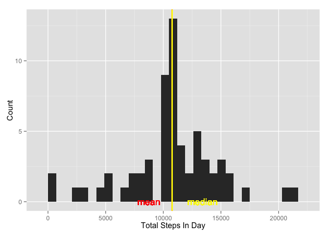

# Reproducible Research: Peer Assessment 1


## Loading and preprocessing the data
We download the data, unzip it, then parse the data into a data frame with the appropriate types.

```r
url <- "https://d396qusza40orc.cloudfront.net/repdata%2Fdata%2Factivity.zip"
zipfile <- "activity.zip" 
download.file(url, zipfile, method="curl")
unzip(zipfile)
data <- read.csv("activity.csv", colClasses=c("integer", "Date", "integer"))
```


## What is mean total number of steps taken per day?
1. Make a histogram of the total number of steps taken each day

We group by day using the date field, then sum the number of steps while ignoring missing data. Then we use the resulting data frame to create a histogram of the total number of steps taken in each day.

```r
library(dplyr)
```

```
## 
## Attaching package: 'dplyr'
## 
## The following object is masked from 'package:stats':
## 
##     filter
## 
## The following objects are masked from 'package:base':
## 
##     intersect, setdiff, setequal, union
```

```r
library(ggplot2)
total_steps <- data %>% dplyr::group_by(date) %>% dplyr::summarize(daily_steps=sum(steps, na.rm=T))
tsp <- ggplot(total_steps, aes(x=daily_steps)) + 
  geom_histogram(binwidth=700) + 
  xlab("Total Steps In Day") +
  ylab("Count")
tsp
```

 

As you can see, the highest reported number of steps taken are in the lowest category (<700 steps). We will see later that can be primarily driven by the fact that we ignored all intervals with missing data, effectively imputing a value of 0 for those intervals. 

If you ignore the lowest category, the data has a Gaussian look. The second highest cluster of scores happens at around 10,000 steps. Most activity trackers have a goal of 10,000 steps, so this data shows that our subject has probably been working hard to hit that goal during this time period.

2. Calculate and report the mean and median total number of steps taken per day

```r
total_steps_mean <- mean(total_steps$daily_steps, na.rm=T)
total_steps_median <- median(total_steps$daily_steps, na.rm=T)
```
The mean number of steps is 9354.2295082 and the median is 10395. Here's where they fall on the histogram of Total Steps Per Day:

```r
tsp <- tsp + 
  geom_vline(aes(xintercept=total_steps_mean), color="red", size=1) + 
  geom_text(aes(total_steps_mean,0, label="mean"), color="red", hjust=1.5, show_guide=F) +
  geom_vline(aes(xintercept=total_steps_median), colour="yellow", size=1) +
  geom_text(aes(total_steps_median,0, label="median"), colour="yellow", hjust=-0.5, show_guide=F) 
tsp
```

 

You can see that the median is right about where we would expect it, but the mean is skewed low due to the fact that we ignored NA values.

## What is the average daily activity pattern?
1. Make a time series plot (i.e. type = "l") of the 5-minute interval (x-axis) and the average number of steps taken, averaged across all days (y-axis)
We group the data by interval, then take the mean of each interval for this data. The result is plotted with a line chart:

```r
library(dplyr)
period_steps <- data %>% dplyr::group_by(interval) %>% dplyr::summarize(avg_steps=mean(steps, na.rm=T))
qplot(interval, avg_steps, data=period_steps, xlab="Interval", ylab="Average Steps", main="Daily Activity Pattern", geom="line")
```

 

You can see that our subject tends to rise about 5 a.m. (assuming this is local time...), does their heaviest activity in the morning, has moderate activity during the day, then goes to bed around 10 p.m.

2. Which 5-minute interval, on average across all the days in the dataset, contains the maximum number of steps?

```r
max_avg_steps <- max(period_steps$avg_steps)
max_period <- period_steps %>% dplyr::filter(avg_steps==max_avg_steps)
max_interval <- max_period$interval
```

Our subject tends to exert their max activity at interval 835.

## Imputing missing values
1. Calculate and report the total number of missing values in the dataset (i.e. the total number of rows with NAs)

```r
num_missing_steps <- sum(is.na(data$steps))
```

This data is missing steps values for 2304 intervals.

2. Devise a strategy for filling in all of the missing values in the dataset. The strategy does not need to be sophisticated. For example, you could use the mean/median for that day, or the mean for that 5-minute interval, etc.
The strategy that we will use is to use the mean for that interval.

3. Create a new dataset that is equal to the original dataset but with the missing data filled in.
We simply merge the original data with the period_steps by interval. this will add the avg_steps data to each row in the data set. Then we can go through each row, and if create a new column that holds either the actual steps, or the imputed value if the data is missing.

```r
  library(plyr)
```

```
## -------------------------------------------------------------------------
## You have loaded plyr after dplyr - this is likely to cause problems.
## If you need functions from both plyr and dplyr, please load plyr first, then dplyr:
## library(plyr); library(dplyr)
## -------------------------------------------------------------------------
## 
## Attaching package: 'plyr'
## 
## The following objects are masked from 'package:dplyr':
## 
##     arrange, count, desc, failwith, id, mutate, rename, summarise,
##     summarize
```

```r
  library(dplyr)
  imputed_data <- merge(data, period_steps, by="interval", sort=F)%>% 
    dplyr::mutate(imputed_steps=ifelse(is.na(steps), avg_steps, steps)) %>% 
    dplyr::arrange(date, interval)
```


4. Make a histogram of the total number of steps taken each day and Calculate and report the mean and median total number of steps taken per day. 
Once again, we group by date, and sume the total number os steps for each day.

```r
imputed_total_steps <- imputed_data %>% group_by(date) %>% dplyr::summarize(daily_steps=sum(imputed_steps, na.rm=T))
#qplot(daily_steps, data=imputed_total_steps, binwidth=700, geom="histogram", xlab="Total Steps In Day", ylab="Count")
tsp <- ggplot(imputed_total_steps, aes(x=daily_steps)) + 
  geom_histogram(binwidth=700) + 
  xlab("Total Steps In Day") +
  ylab("Count")
tsp
```

 

```r
imputed_total_steps_mean <- mean(imputed_total_steps$daily_steps)
imputed_total_steps_median <- median(imputed_total_steps$daily_steps)
tsp <- tsp + 
  geom_vline(aes(xintercept=imputed_total_steps_mean), color="red", size=1) + 
  geom_text(aes(imputed_total_steps_mean,0, label="mean"), color="red", hjust=1.5, show_guide=F) +
  geom_vline(aes(xintercept=imputed_total_steps_median), colour="yellow", size=1) +
  geom_text(aes(imputed_total_steps_median,0, label="median"), colour="yellow", hjust=-0.5, show_guide=F) 
tsp
```

 

Do these values differ from the estimates from the first part of the assignment? What is the impact of imputing missing data on the estimates of the total daily number of steps?
The biggest difference, as you can see from the chart, is that the large number of days with < 700 steps is eliminated. those days have been shifted to the mean, which is just over 10,000 steps. Further, the mean (1.0766189\times 10^{4}) and the median (1.0766189\times 10^{4}) are almost exactly equal. 

## Are there differences in activity patterns between weekdays and weekends?
For this part the weekdays() function may be of some help here. Use the dataset with the filled-in missing values for this part.

1. Create a new factor variable in the dataset with two levels – “weekday” and “weekend” indicating whether a given date is a weekday or weekend day.
We simply add a new column with a factor that is determined using lubridate's wday function.

```r
library(dplyr)
library(lubridate)
```

```
## 
## Attaching package: 'lubridate'
## 
## The following object is masked from 'package:plyr':
## 
##     here
```

```r
# wday(date) == 1 for Sunday and 7 for Saturday
week_data <- imputed_data %>% dplyr::mutate(day=factor(ifelse(wday(date)==1 | wday(date)==7, "weekend", "weekday"))) 
```


2. Make a panel plot containing a time series plot (i.e. type = "l") of the 5-minute interval (x-axis) and the average number of steps taken, averaged across all weekday days or weekend days (y-axis). See the README file in the GitHub repository to see an example of what this plot should look like using simulated data.

```r
library(ggplot2)
avg_week_data <- week_data %>% dplyr::group_by(day,interval) %>% dplyr::summarize(avg_steps=mean(imputed_steps))
p <- ggplot(avg_week_data, aes(x=interval, y=avg_steps)) + 
  geom_line() + 
  facet_grid(day ~ .) +
  ylab("Average Steps") +
  xlab("Interval") +
  ggtitle("Average Steps ")
p
```

 

We can see that our subject wakes a little later on the weekends, and doesn't seem to work out as heavily in the morning. However, overall activity is higher throughout the day on the weekends.
